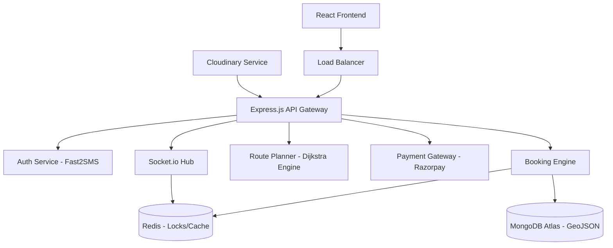

# EV-Locater Production System Design

## 1. High-Level Architecture
The system follows a modular monolith architecture (transitionable to microservices) to ensure high availability and scalability.

## 2. Infrastructure & Scalability
- **Node.js Clusters**: Utilize the `cluster` module or PM2 to scale across CPU cores.
- **Horizontal Scaling**: API servers behind an Nginx load balancer.
- **WebSocket Scaling**: Use `socket.io-redis` adapter to synchronize events across multiple server instances.
- **Geo-Spatial Scaling**: Shard MongoDB based on `location` (geographies) if the station count exceeds 100k.

## 3. Database Strategy (MongoDB)
- **Indexing**: 
  - `location: "2dsphere"` for geo-searches.
  - `startTime: 1, chargerId: 1` compound index for fast-booking lookups.
- **Consistency**: Use MongoDB transactions (ACID) for the booking flow to prevent over-subscription of chargers.

## 4. UI/UX Strategy (Premium Interface)
- **Glassmorphism**: Using transparent backgrounds with blurs for maps and modals.
- **Dark Mode First**: Primary color: `#0B0E14` | Accent: `#00F5D4` (Neon Green).
- **Micro-interactions**: 
  - Lottie animations for "Searching for Stations".
  - GSAP for smooth layout transitions between map and list views.

## 5. Security Checklist
- [ ] **Rate Limiting**: 100 requests per 15 mins for standard APIs, 5 per min for OTP.
- [ ] **Data Sanitization**: MongoDB injection prevention using `express-mongo-sanitize`.
- [ ] **CORS**: Restricted to production domains only.
- [ ] **HTTPS**: Strict SSL/TLS termination at the Load Balancer.

## 6. Real-time Slot Engine
Instead of polling, we use Socket.io. When a user navigates the map, they join a "geographic room" (e.g., `room:lat_long_grid_1km`). When a booking occurs, only users in that "room" receive the update, minimizing bandwidth and CPU usage on the client side.
